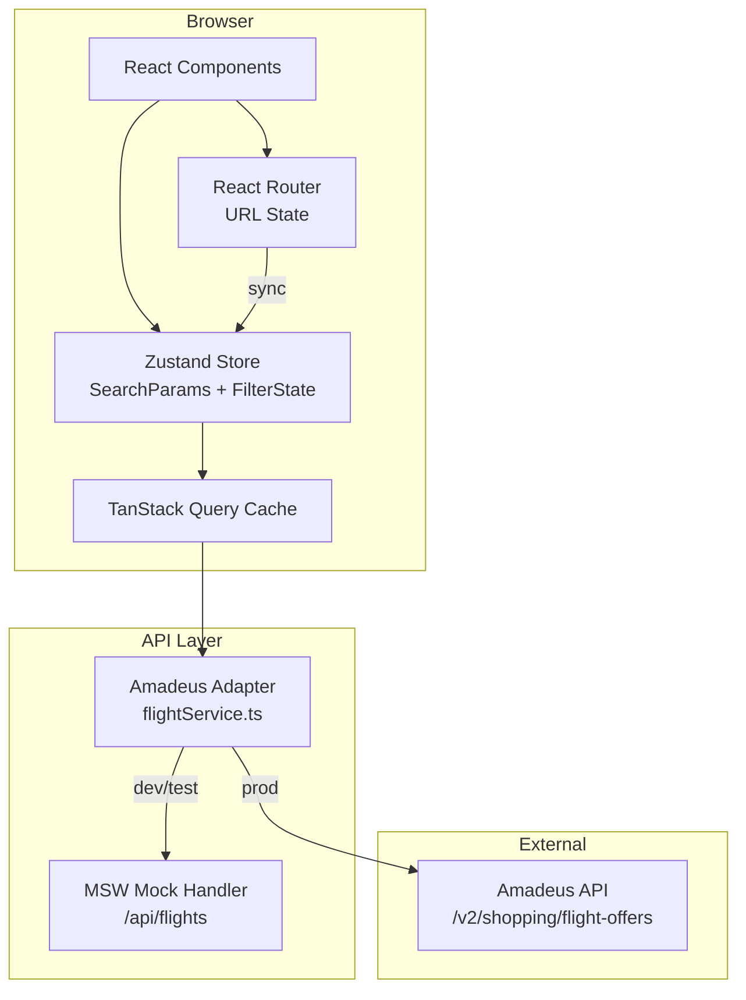

# Design Document — Flight Search App

## Overview

Flight Search App è una Single Page Application (SPA) che consente agli utenti di cercare voli, filtrare i risultati e visualizzare un calendario prezzi. L'applicazione si comporta come un motore di ricerca voli autonomo, aggregando dati da un'API esterna (Amadeus Self-Service API) e presentandoli in modo chiaro e navigabile.

### Stack tecnologico

| Layer | Tecnologia | Motivazione |
|---|---|---|
| Framework UI | React 18 + TypeScript | Ecosistema maturo, type safety, component model |
| Build tool | Vite | Dev server veloce, HMR, bundle ottimizzato |
| Routing | React Router v6 | URL-based state, history API, nested routes |
| State management | Zustand | Leggero, senza boilerplate, slice pattern |
| Data fetching | TanStack Query v5 | Caching, loading/error states, deduplication |
| Styling | Tailwind CSS | Utility-first, responsive design, dark mode |
| Validazione form | React Hook Form + Zod | Validazione schema-driven, type inference |
| Testing (unit) | Vitest + React Testing Library | Integrazione nativa con Vite |
| Testing (property) | fast-check | PBT library matura per TypeScript/JavaScript |
| API esterna | Amadeus Self-Service API v2 | `/v2/shopping/flight-offers`, free tier disponibile |

### Principi architetturali

- **URL come fonte di verità** per i parametri di ricerca (Req. 6.2, 6.3)
- **Separazione netta** tra layer di dati (API adapter), business logic (hooks/store) e presentazione (componenti)
- **Mock layer intercambiabile**: in assenza di credenziali Amadeus, un mock service worker (MSW) fornisce dati strutturati identici
- **Filtraggio client-side**: i filtri (Req. 3) operano sulla lista già recuperata, senza nuove chiamate API

---

## Architecture



### Flusso principale

1. L'utente compila il `SearchForm` e avvia la ricerca
2. I parametri vengono serializzati nell'URL (query string) tramite React Router
3. `useFlightSearch` (TanStack Query) legge i parametri dall'URL e chiama `flightService.search()`
4. `flightService` chiama l'Amadeus API (o il mock) e trasforma la risposta in `FlightResult[]`
5. I risultati vengono salvati nella cache di TanStack Query
6. `FilterPanel` aggiorna lo stato locale dei filtri in Zustand; i risultati filtrati sono derivati in-memory
7. Il `PriceCalendar` esegue query separate per ogni giorno del range, con debounce

---

## Components and Interfaces

### Struttura dei componenti

```
src/
├── components/
│   ├── SearchForm/
│   │   ├── SearchForm.tsx          # Form principale con validazione Zod
│   │   ├── AirportInput.tsx        # Input con autocompletamento IATA
│   │   ├── DatePicker.tsx          # Selezione date con validazione
│   │   ├── PassengerSelector.tsx   # Contatore adulti/bambini/neonati
│   │   └── CabinClassSelect.tsx    # Dropdown classe cabina
│   ├── FlightResults/
│   │   ├── FlightResultList.tsx    # Lista risultati con virtualizzazione
│   │   ├── FlightResultCard.tsx    # Card singolo volo
│   │   └── FlightDetail.tsx        # Dettaglio itinerario espanso
│   ├── FilterPanel/
│   │   ├── FilterPanel.tsx         # Contenitore filtri
│   │   ├── PriceRangeSlider.tsx    # Range slider prezzo
│   │   ├── StopsFilter.tsx         # Checkbox scali
│   │   ├── AirlineFilter.tsx       # Multi-select compagnie
│   │   ├── DepartureTimeFilter.tsx # Fasce orarie
│   │   └── DurationFilter.tsx      # Durata massima
│   ├── PriceCalendar/
│   │   └── PriceCalendar.tsx       # Griglia calendario con prezzi
│   └── common/
│       ├── LoadingSpinner.tsx
│       └── ErrorMessage.tsx
├── hooks/
│   ├── useFlightSearch.ts          # TanStack Query wrapper
│   ├── useAirportSearch.ts         # Autocompletamento aeroporti
│   └── useFilteredResults.ts       # Derivazione risultati filtrati
├── store/
│   ├── searchStore.ts              # Zustand: parametri ricerca
│   └── filterStore.ts              # Zustand: stato filtri attivi
├── services/
│   ├── flightService.ts            # Adapter Amadeus API
│   ├── airportService.ts           # Ricerca aeroporti
│   └── mockData.ts                 # Dati mock strutturati
├── types/
│   └── flight.ts                   # Tutti i tipi TypeScript
└── utils/
    ├── flightParser.ts             # Parsing risposta Amadeus → FlightResult
    ├── urlSerializer.ts            # SearchParams ↔ URL query string
    └── filterUtils.ts              # Funzioni pure di filtraggio
```

### Interfacce principali

```typescript
// SearchForm → flightService
interface SearchParams {
  origin: string;          // IATA code, es. "FCO"
  destination: string;     // IATA code, es. "LHR"
  departureDate: string;   // ISO 8601, es. "2025-03-15"
  returnDate?: string;     // Solo per andata e ritorno
  tripType: 'one-way' | 'round-trip' | 'multi-city';
  passengers: PassengerCount;
  cabinClass: CabinClass;
}

interface PassengerCount {
  adults: number;    // ≥1
  children: number;  // ≥0
  infants: number;   // ≥0, ≤ adults
}

type CabinClass = 'ECONOMY' | 'PREMIUM_ECONOMY' | 'BUSINESS' | 'FIRST';

// Risultato normalizzato (output del parser)
interface FlightResult {
  id: string;
  itineraries: Itinerary[];
  price: Price;
  validatingAirlineCodes: string[];
  numberOfBookableSeats: number;
}

interface Itinerary {
  duration: string;        // ISO 8601 duration, es. "PT2H30M"
  segments: Segment[];
}

interface Segment {
  departure: FlightEndpoint;
  arrival: FlightEndpoint;
  carrierCode: string;
  number: string;          // Numero volo, es. "AZ123"
  aircraft: string;
  duration: string;
  numberOfStops: number;
  baggage?: BaggageInfo;
}

interface FlightEndpoint {
  iataCode: string;
  terminal?: string;
  at: string;              // ISO 8601 datetime
}

interface Price {
  currency: string;
  total: string;           // Prezzo totale come stringa decimale
  base: string;
  fees: Fee[];
  grandTotal: string;
}

interface BaggageInfo {
  includedCheckedBags?: { quantity: number };
  includedCabinBags?: { quantity: number };
}
```

### Interfaccia FilterState (Zustand)

```typescript
interface FilterState {
  priceRange: [number, number];
  stops: ('direct' | '1-stop' | '2+')[];
  airlines: string[];
  departureTimeSlots: ('morning' | 'afternoon' | 'evening' | 'night')[];
  maxDurationHours: number | null;
  sortBy: 'price' | 'duration' | 'departure' | 'arrival';
  sortOrder: 'asc' | 'desc';
}
```

---

## Data Models

### Mapping Amadeus API → FlightResult

L'Amadeus Self-Service API (`GET /v2/shopping/flight-offers`) restituisce un oggetto con:
- `data`: array di `FlightOffer` (struttura Amadeus nativa)
- `dictionaries`: lookup tables per compagnie, aeroporti, aeromobili

Il `flightParser.ts` normalizza questa struttura in `FlightResult[]`:

```
AmadeusFlightOffer
  └── itineraries[]
        └── segments[]
              ├── departure { iataCode, terminal, at }
              ├── arrival   { iataCode, terminal, at }
              ├── carrierCode
              ├── number
              └── duration
  └── price { currency, total, grandTotal, fees[] }
  └── travelerPricings[] → baggage info
```

### URL Serialization (SearchParams ↔ Query String)

I parametri di ricerca vengono serializzati nell'URL per supportare condivisione e navigazione back/forward:

```
/results?origin=FCO&destination=LHR&dep=2025-03-15&ret=2025-03-22
         &type=round-trip&adults=2&children=0&infants=0&cabin=ECONOMY
```

Il modulo `urlSerializer.ts` espone:
- `serializeSearchParams(params: SearchParams): URLSearchParams`
- `deserializeSearchParams(search: URLSearchParams): SearchParams | null`

### Airport Data Model

```typescript
interface Airport {
  iataCode: string;    // "FCO"
  name: string;        // "Leonardo da Vinci International Airport"
  city: string;        // "Rome"
  country: string;     // "Italy"
  countryCode: string; // "IT"
}
```

La ricerca aeroporti usa l'endpoint Amadeus `GET /v1/reference-data/locations` con parametro `subType=AIRPORT` e `keyword={query}`.

### Price Calendar Data Model

```typescript
interface PriceCalendarEntry {
  date: string;          // ISO 8601 date
  minPrice: number | null; // null = nessun volo disponibile
  currency: string;
  isLowest: boolean;     // true se sotto la media del periodo
}
```

---

## Correctness Properties

*A property is a characteristic or behavior that should hold true across all valid executions of a system — essentially, a formal statement about what the system should do. Properties serve as the bridge between human-readable specifications and machine-verifiable correctness guarantees.*

### Property 1: Round-trip serializzazione SearchParams

*For any* oggetto `SearchParams` valido, serializzarlo in URL query string e poi deserializzarlo deve produrre un oggetto equivalente all'originale.

**Validates: Requirements 6.2**

---

### Property 2: Round-trip FlightResult JSON

*For any* oggetto `FlightResult` valido, serializzarlo in JSON e poi deserializzarlo deve produrre un oggetto equivalente all'originale.

**Validates: Requirements 7.3**

---

### Property 3: Parsing produce FlightResult validi

*For any* risposta API Amadeus strutturata e valida, il parser deve produrre un array di `FlightResult` in cui ogni elemento ha tutti i campi obbligatori (id, itineraries, price, validatingAirlineCodes) valorizzati correttamente.

**Validates: Requirements 7.2**

---

### Property 4: Gestione risposta API malformata

*For any* oggetto JSON arbitrario non conforme allo schema Amadeus, il parser non deve lanciare eccezioni non gestite, ma deve restituire un errore strutturato.

**Validates: Requirements 7.5**

---

### Property 5: Filtraggio per prezzo è corretto

*For any* lista di `FlightResult` e qualsiasi range di prezzo `[min, max]`, tutti i risultati filtrati devono avere `price.grandTotal` compreso nell'intervallo `[min, max]`, e nessun risultato escluso deve avere prezzo nell'intervallo.

**Validates: Requirements 3.1**

---

### Property 6: Filtraggio per scali è corretto

*For any* lista di `FlightResult` e qualsiasi selezione di filtri scali (`direct`, `1-stop`, `2+`), ogni risultato restituito deve avere un numero di scali coerente con almeno uno dei filtri selezionati.

**Validates: Requirements 3.2**

---

### Property 7: Filtraggio per compagnia è corretto

*For any* lista di `FlightResult` e qualsiasi selezione di compagnie aeree, ogni risultato restituito deve avere almeno una compagnia validante inclusa nella selezione.

**Validates: Requirements 3.3**

---

### Property 8: Filtraggio per fascia oraria è corretto

*For any* lista di `FlightResult` e qualsiasi selezione di fasce orarie (`morning`, `afternoon`, `evening`, `night`), ogni risultato restituito deve avere l'orario di partenza del primo segmento compreso in almeno una delle fasce selezionate.

**Validates: Requirements 3.4**

---

### Property 9: Filtraggio per durata massima è corretto

*For any* lista di `FlightResult` e qualsiasi valore di durata massima in ore, ogni risultato restituito deve avere durata totale dell'itinerario ≤ maxDurationHours.

**Validates: Requirements 3.5**

---

### Property 10: Ordinamento è corretto e preserva gli elementi

*For any* lista di `FlightResult` e qualsiasi criterio di ordinamento (`price`, `duration`, `departure`, `arrival`), la lista ordinata deve contenere esattamente gli stessi elementi della lista originale e deve rispettare la relazione d'ordine per il criterio scelto (incluso l'ordinamento predefinito per prezzo crescente).

**Validates: Requirements 2.2, 3.7**

---

### Property 11: Reset filtri ripristina la lista originale

*For any* lista di `FlightResult` e qualsiasi stato di filtri attivi, applicare i filtri e poi rimuoverli tutti deve restituire una lista con gli stessi elementi della lista originale.

**Validates: Requirements 3.8**

---

### Property 12: Validazione date — ritorno non precede partenza

*For any* coppia di date `(departureDate, returnDate)` dove `returnDate < departureDate`, la validazione del form deve rifiutare l'input e non permettere l'invio.

**Validates: Requirements 1.8**

---

### Property 13: Validazione aeroporto — origine ≠ destinazione

*For any* codice IATA, se `origin === destination`, la validazione del form deve rifiutare l'input e mostrare un messaggio di errore.

**Validates: Requirements 5.4**

---

### Property 14: Autocompletamento aeroporti — risultati coerenti con query

*For any* stringa di ricerca di almeno 2 caratteri, tutti i suggerimenti restituiti devono contenere la stringa (case-insensitive) nel nome dell'aeroporto, nella città o nel codice IATA.

**Validates: Requirements 1.1, 5.1, 5.3**

---

### Property 15: Rendering suggerimento aeroporto contiene tutti i campi

*For any* oggetto `Airport`, il rendering del componente di suggerimento deve contenere il nome dell'aeroporto, la città, il paese e il codice IATA.

**Validates: Requirements 5.2**

---

### Property 16: Scambio origine/destinazione è corretto

*For any* coppia `(origin, destination)`, dopo aver eseguito lo scambio, il valore di `origin` deve essere uguale al valore originale di `destination` e viceversa.

**Validates: Requirements 5.5**

---

### Property 17: isLowest nel calendario è calcolato correttamente

*For any* array di `PriceCalendarEntry` con prezzi variabili, il flag `isLowest` deve essere `true` esattamente per le entry con `minPrice` strettamente inferiore alla media dei prezzi disponibili nel periodo.

**Validates: Requirements 4.3**

---

### Property 18: Rendering FlightResultCard contiene tutti i campi obbligatori

*For any* oggetto `FlightResult`, il rendering del componente `FlightResultCard` deve contenere la compagnia aerea, l'orario di partenza e arrivo, la durata totale, il numero di scali e il prezzo totale.

**Validates: Requirements 2.1**

---

## Error Handling

### Errori di validazione form

Gestiti da React Hook Form + Zod prima dell'invio. Messaggi inline accanto al campo errato. Il pulsante di ricerca rimane disabilitato finché il form non è valido (Req. 1.7, 1.8, 5.4).

### Errori API

| Scenario | Comportamento |
|---|---|
| API non raggiungibile (network error) | Messaggio di errore visibile + log console (Req. 7.4) |
| Risposta malformata (parse error) | Messaggio descrittivo + log dell'errore raw (Req. 7.5) |
| Nessun risultato (200 con lista vuota) | Messaggio informativo + suggerimenti date/rotte alternative (Req. 2.3) |
| Timeout (>5s) | Annullamento della richiesta + messaggio di errore (Req. 1.6) |

### Strategia di retry

TanStack Query gestisce automaticamente il retry con backoff esponenziale (max 3 tentativi) per errori di rete. Gli errori 4xx (es. parametri non validi) non vengono ritentati.

### Error Boundaries

Un `ErrorBoundary` React avvolge il componente `FlightResults` per isolare crash imprevisti senza abbattere l'intera applicazione.

---

## Testing Strategy

### Approccio duale

L'applicazione usa sia **unit test** (esempi concreti) sia **property-based test** (proprietà universali) per una copertura completa.

### Unit Test (Vitest + React Testing Library)

- Rendering corretto dei componenti con dati mock
- Interazioni utente: click, input, submit
- Messaggi di errore per input non validi
- Comportamento del `FilterPanel` con filtri attivi/inattivi
- Rendering del `PriceCalendar` con date disponibili e non disponibili
- Integrazione `SearchForm` → URL serialization

### Property-Based Test (fast-check, min. 100 iterazioni per proprietà)

Ogni property test è taggato con un commento nel formato:
`// Feature: flight-search-app, Property N: <testo della proprietà>`

| Property | Modulo testato | Generatori fast-check |
|---|---|---|
| P1: Round-trip SearchParams | `urlSerializer.ts` | `fc.record` con campi IATA, date, passeggeri |
| P2: Round-trip FlightResult JSON | `flightParser.ts` | `fc.record` che genera `FlightResult` strutturati |
| P3: Parsing produce FlightResult validi | `flightParser.ts` | `fc.record` che genera `AmadeusFlightOffer` validi |
| P4: Gestione risposta malformata | `flightParser.ts` | `fc.anything()` (JSON arbitrario) |
| P5: Filtraggio prezzo | `filterUtils.ts` | `fc.array(flightResultArb)` + `fc.tuple(fc.float, fc.float)` |
| P6: Filtraggio scali | `filterUtils.ts` | `fc.array(flightResultArb)` + `fc.subarray(['direct','1-stop','2+'])` |
| P7: Filtraggio compagnia | `filterUtils.ts` | `fc.array(flightResultArb)` + `fc.array(fc.string)` |
| P8: Filtraggio fascia oraria | `filterUtils.ts` | `fc.array(flightResultArb)` + `fc.subarray(['morning','afternoon','evening','night'])` |
| P9: Filtraggio durata | `filterUtils.ts` | `fc.array(flightResultArb)` + `fc.nat` |
| P10: Ordinamento corretto | `filterUtils.ts` | `fc.array(flightResultArb)` + `fc.constantFrom('price','duration','departure','arrival')` |
| P11: Reset filtri | `filterUtils.ts` | `fc.array(flightResultArb)` + `fc.record(filterStateArb)` |
| P12: Validazione date | `searchSchema.ts` (Zod) | `fc.tuple(fc.date, fc.date)` con returnDate < departureDate |
| P13: Validazione origin === destination | `searchSchema.ts` (Zod) | `fc.string` con origin === destination |
| P14: Autocompletamento coerente | `airportService.ts` | `fc.string({minLength: 2})` + array di Airport mock |
| P15: Rendering suggerimento aeroporto | `AirportInput.tsx` | `fc.record` che genera `Airport` casuali |
| P16: Scambio origine/destinazione | `searchStore.ts` | `fc.tuple(fc.string, fc.string)` |
| P17: isLowest nel calendario | `priceCalendarUtils.ts` | `fc.array(fc.record({minPrice: fc.float, date: fc.string}))` |
| P18: Rendering FlightResultCard | `FlightResultCard.tsx` | `fc.record` che genera `FlightResult` casuali |

### Integration Test

- Chiamata reale (o MSW) all'endpoint Amadeus con parametri validi → verifica struttura risposta
- Flusso completo: SearchForm → URL → TanStack Query → risultati visualizzati

### Configurazione fast-check

```typescript
import { configureGlobal } from 'fast-check';

configureGlobal({
  numRuns: 100,        // minimo 100 iterazioni per proprietà
  verbose: true,       // mostra il caso fallito
});
```
